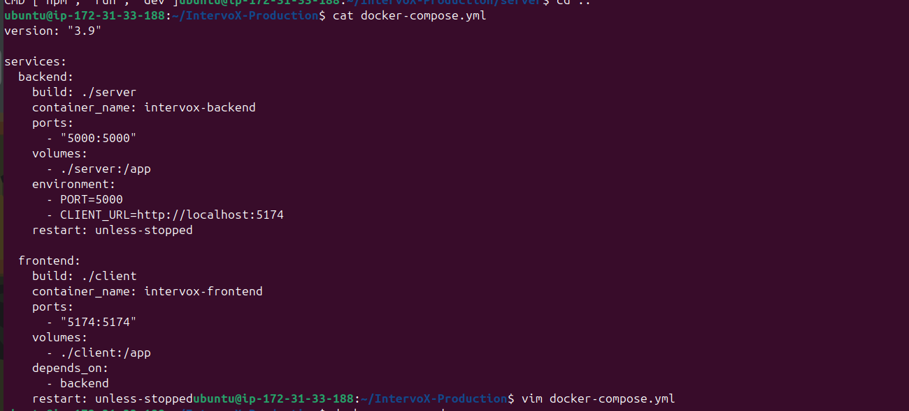
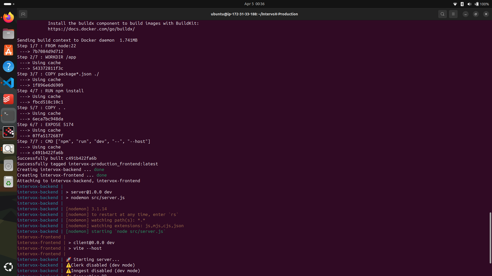
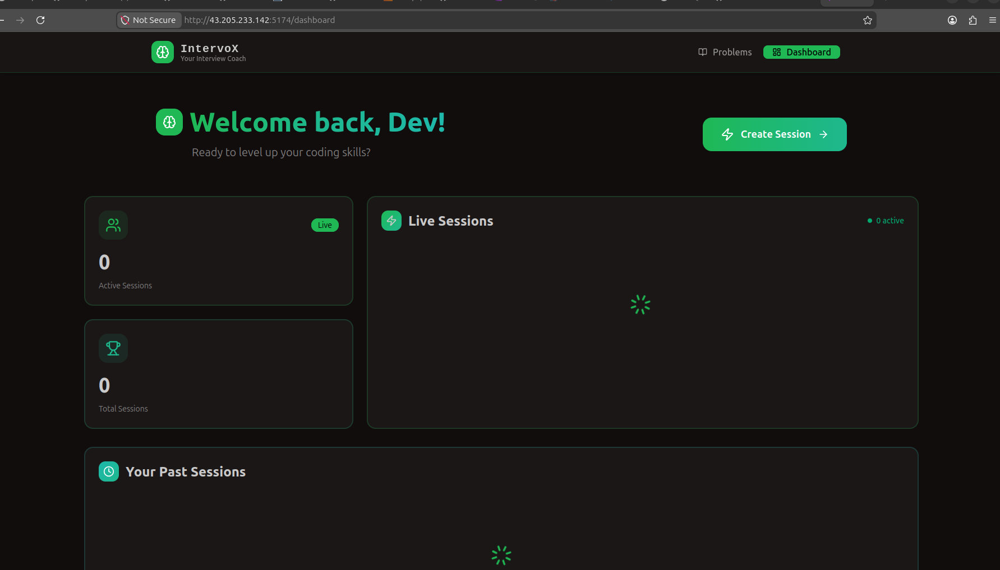
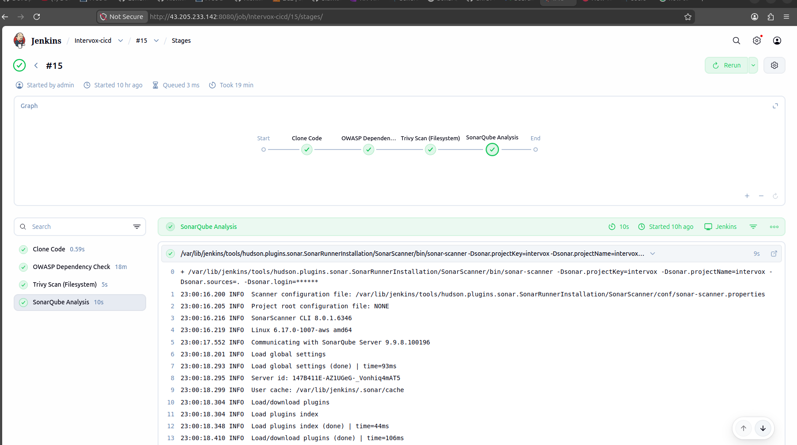
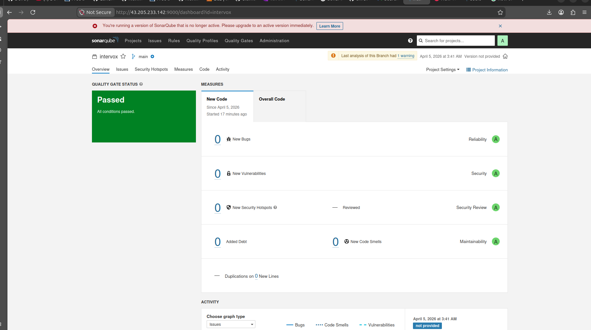
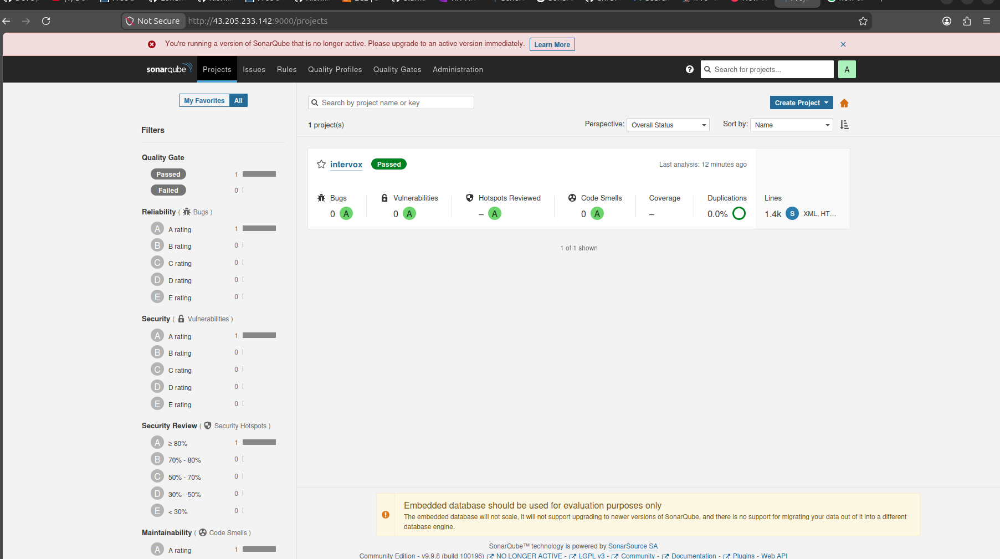
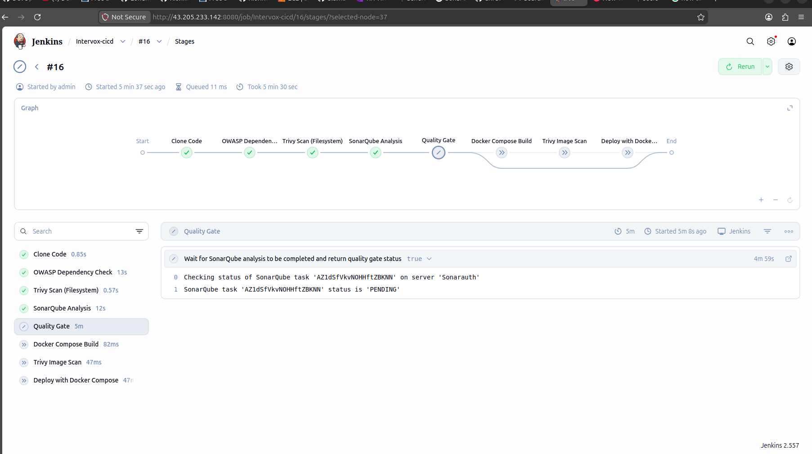
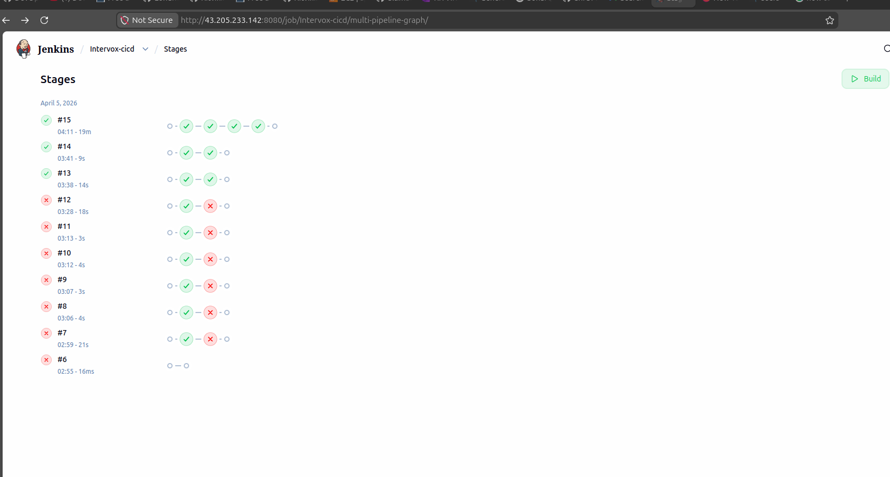

<div align="center">

<br/>

```
██╗███╗   ██╗████████╗███████╗██████╗ ██╗   ██╗ ██████╗ ██╗  ██╗
██║████╗  ██║╚══██╔══╝██╔════╝██╔══██╗██║   ██║██╔═══██╗╚██╗██╔╝
██║██╔██╗ ██║   ██║   █████╗  ██████╔╝██║   ██║██║   ██║ ╚███╔╝ 
██║██║╚██╗██║   ██║   ██╔══╝  ██╔══██╗╚██╗ ██╔╝██║   ██║ ██╔██╗ 
██║██║ ╚████║   ██║   ███████╗██║  ██║ ╚████╔╝ ╚██████╔╝██╔╝ ██╗
╚═╝╚═╝  ╚═══╝   ╚═╝   ╚══════╝╚═╝  ╚═╝  ╚═══╝   ╚═════╝ ╚═╝  ╚═╝

                    @  P R O D U C T I O N
```

### **Enterprise DevSecOps Pipeline — Production Grade**
*Live Coding Interview Platform × Security-First CI/CD*

<br/>
<br/>

[](https://www.jenkins.io/)
[](https://www.sonarqube.org/)
[](https://snyk.io/)
[](https://www.zaproxy.org/)
[](https://www.vaultproject.io/)
[](https://www.docker.com/)
[](https://kubernetes.io/)
[](https://www.terraform.io/)
[](https://aws.amazon.com/)
[](https://www.elastic.co/)

<br/>


> ## 🔥 *"Built with obsessive debugging, 3 AM coffee, and a deep respect for broken pipelines."*


> 🔐 **Shift Left. Fail Fast. Ship Secure.**
> 
> Original platform by [Dhruv Gandhi](https://github.com/dhruv1724) · DevSecOps pipeline by [Ritvik Kant](https://github.com/RitvikIP27)

<br/>

---

</div>

##  Architecture Overview

> *Full pipeline architecture — from source code to production with security at every stage*

<!-- SCREENSHOT: Paste your architecture diagram link below -->


<br/>

---

##  Table of Contents

- [What is Intervox?](#-what-is-intervox)
- [Local Dev Mode](#-local-development-mode-dependency-bypass)
- [Containerization](#-containerization--docker-setup)
- [Jenkins Setup](#-jenkins-configuration)
- [SonarQube Integration](#-sonarqube--sast-integration)
- [Full CI/CD Pipeline](#-full-cicd-pipeline-with-quality-gates)
- [Security Stack](#-security-stack)
- [Infrastructure Stack](#-infrastructure-stack)
- [Pipeline Stages In Detail](#-pipeline-stages-in-detail)
- [Security Best Practices](#-security-best-practices-followed)
- [Implementation Progress](#-implementation-progress)
- [Author](#-author)

<br/>

---

##  What is Intervox?

**Intervox** is a live coding interview and testing platform — think real-time code execution, video, and collaboration baked into one.

This repository documents the **full DevSecOps pipeline** built around Intervox, implementing enterprise-grade security scanning, secrets management, containerization, and monitoring — all wired into an automated CI/CD pipeline. Every commit is scanned, analyzed, and must pass security gates before it ever reaches production.

<br/>

--- 

## 🛡️ Security Stack

| Tool | Category | Purpose | Pipeline Stage |
|------|----------|---------|----------------|
| **SonarQube** | SAST | Static source code analysis | Build |
| **Snyk** | SCA | Dependency vulnerability scanning | Build |
| **HashiCorp Vault** | Secrets | Secrets management — zero hardcoded credentials | Deploy |
| **OWASP ZAP** | DAST | Dynamic runtime attack simulation | Post-Deploy |
| **ELK Stack** | Monitoring | Centralised logging and real-time alerting | Runtime |
| **Jenkins** | CI/CD | Pipeline orchestration | All Stages |
| **Docker** | Container | Application containerization | Build |
| **Kubernetes** | Orchestration | Container deployment and scaling | Deploy |

<br/>

---

## ☁️ Infrastructure Stack

| Technology | Purpose |
|------------|---------|
| **AWS EC2** | Compute — Jenkins, SonarQube, Vault hosted here |
| **AWS S3** | Terraform remote state storage |
| **AWS IAM** | Access control and least-privilege permissions |
| **Docker** | Application containerization |
| **Kubernetes** | Container orchestration at scale |
| **Terraform** | Infrastructure as Code — all infra versioned |

<br/>


---

##  Local Development Mode *(Dependency Bypass)*

### The Problem

Intervox depends on multiple paid/external services that aren't available in a local or CI environment:

| Service | Purpose |
|---------|---------|
| Clerk | Authentication |
| Stream | Chat & Video |
| JDoodle | Code Execution |
| MongoDB | Database |
| Inngest | Event Processing |

Without these, the app crashes at startup — which blocks pipeline integration entirely.

### The Approach

A **dev-mode architecture** was engineered to bypass all of this cleanly:

- **Graceful Degradation** — services fail softly instead of crashing hard
- **Dependency Mocking** — external APIs replaced with local stubs
- **Module Aliasing** (Vite) — swap out third-party libraries at build time
- **Environment-Aware Logic** — different code paths for `dev` vs `prod`

### Backend Changes

- **Database** — MongoDB connection disabled for local execution
- **Stream** — Skips initialization if API keys are absent; returns mock responses
- **JDoodle** — Code execution endpoint returns placeholder output
- **Auth** — Mock user injected directly into the request object

### Frontend Changes

- Removed hard dependency on Clerk API keys
- Module aliasing: `@clerk/clerk-react` → local `mockClerk.js`
- Mocked: `useUser`, `useAuth`, `SignedIn`, `SignedOut`, `UserButton`
- Fixed `isLoaded` / `isSignedIn` conditions to prevent blank UI renders

### Result


✅  Backend runs without any external service
✅  Frontend renders without an auth provider
✅  App is stable for CI/CD pipeline integration
✅  Ready for containerization and Kubernetes deployment


<br/>

---

## 🐳 Containerization — Docker Setup

### Step 1 — Dockerfiles (Frontend + Backend)

Wrote separate Dockerfiles for the frontend and backend services.

> ⚠️ **Error Encountered:** Node version mismatch between local environment and Docker base image.
> **Fix:** Pinned the exact Node version in the Dockerfile to match the project requirements.

### Step 2 — Docker Compose

Wrote a `docker-compose.yml` to orchestrate both services together with a single command.


### Step 3 — Build & Trigger

> ⚠️ **High Severity Error:** Volume mounts in the Dockerfile caused conflicts — these are used to keep containers in sync with local machine code (and will be used for future microservices). Temporarily **disabled volume mounts** to unblock the pipeline.

<!-- SCREENSHOT: Docker Compose build process — paste image link below -->

> *`docker compose up --build` — full rebuild and container startup*

### Step 4 — Environment Configuration

Updated `.env` for both services:

| Service | Port | Notes |
|---------|------|-------|
| Frontend | `5174` | Vite dev server URL configured |
| Backend | `5000` | Local packages + `localhost` start command |

### Step 5 — Verify the Running App

Tore down previous builds and rebuilt clean:

```bash
docker compose down          # Remove previous containers
docker compose up --build    # Rebuild and start fresh
```

<!-- SCREENSHOT: Running application in browser — paste image link below -->

> *Intervox running locally via Docker — frontend on :5174, backend on :5000*

<br/>

---

## ⚙️ Jenkins Configuration

Jenkins was configured and exposed on **port 8080** on the EC2 instance.

> 🔒 **Security Note:** Port 8080 was kept **restricted to personal IP only** — not open to the public internet. This is intentional. A previous EC2 instance was compromised by a web crawler that detected the open port and launched an automated attack. Lesson learned.

<br/>

---

## 🔍 SonarQube — SAST Integration

SonarQube was deployed via Docker using the **`lts-community`** image on **port 9000**.

### Connecting Jenkins ↔ SonarQube

1. Add the SonarQube server URL inside Jenkins → *Manage Jenkins → Configure System*
2. Generate a **secret token** in SonarQube and add it to Jenkins credentials
3. Webhooks configured so both services can communicate results back and forth

### Required Jenkins Plugins

Installed the following via *Manage Jenkins → Plugin Manager*:

- `SonarQube Scanner`
- `Sonar Quality Gates`
- `Docker Pipeline`
- `OWASP Dependency-Check`

> After installation: **Restart Jenkins → Restart SonarQube**

### Building the Early CI Pipeline

Built and ran the first pipeline covering stages up to SonarQube analysis.

> ⚠️ **Error Encountered:** Services couldn't ping each other over the external network.
> **Fix:** Disabled external networking — switched to EC2's own `localhost` connection between services. This resolved the communication issue entirely.

<!-- SCREENSHOT: Jenkins pipeline run (SonarQube stage passing) — paste image link below -->

> *First successful pipeline run with SonarQube analysis stage passing ✅*
 

> 📝 **Reminder:** Always rotate your authentication tokens between services to avoid credential expiry errors in later runs.

<br/>

---

## 🚀 Full CI/CD Pipeline with Quality Gates

### Quality Gates

Quality Gates act as a **final automated gatekeeper** — the build only proceeds to the deploy stage if the code meets defined thresholds:

- Code coverage above a minimum threshold
- Zero critical vulnerabilities
- Technical debt within acceptable limits
- Security hotspot review rate met

If any gate fails → **pipeline stops. No deployment.**

Here My quality Gate gave a green Signal indicating the pipeline to move forward


<!-- SCREENSHOT: Full pipeline passing with Quality Gates — paste image link below -->

> *Complete CI/CD pipeline — from source scan → quality gates → build → deploy to production*

### What Real DevSecOps Looks Like

This kind of work demands patience, systematic debugging, and situational awareness. Here's proof:

<!-- SCREENSHOT: Failed build history before the final success — paste image link below -->

> *Every failure is a lesson. The number of failed builds before a successful one tells the real story of engineering.*

<br/>

---

## 🛡️ Security Stack

| Tool | Category | Purpose | Pipeline Stage |
|------|----------|---------|----------------|
| **SonarQube** | SAST | Static source code analysis | Build |
| **Snyk** | SCA | Dependency vulnerability scanning | Build |
| **HashiCorp Vault** | Secrets | Secrets management — zero hardcoded credentials | Deploy |
| **OWASP ZAP** | DAST | Dynamic runtime attack simulation | Post-Deploy |
| **ELK Stack** | Monitoring | Centralised logging and real-time alerting | Runtime |
| **Jenkins** | CI/CD | Pipeline orchestration | All Stages |
| **Docker** | Container | Application containerization | Build |
| **Kubernetes** | Orchestration | Container deployment and scaling | Deploy |

<br/>

---

## ☁️ Infrastructure Stack

| Technology | Purpose |
|------------|---------|
| **AWS EC2** | Compute — Jenkins, SonarQube, Vault hosted here |
| **AWS S3** | Terraform remote state storage |
| **AWS IAM** | Access control and least-privilege permissions |
| **Docker** | Application containerization |
| **Kubernetes** | Container orchestration at scale |
| **Terraform** | Infrastructure as Code — all infra versioned |

<br/>

---

## 🔬 Pipeline Stages In Detail

### 🔵 SAST — SonarQube
- Scans Intervox source code **statically** — without executing it
- Detects SQL injection risks, XSS vulnerabilities, insecure coding patterns
- Pipeline **automatically fails** if critical severity issues are found
- Full vulnerability report with remediation steps available on the dashboard

### 🟣 SCA — Snyk Dependency Scanning
- Every third-party library used by Intervox is scanned against the **CVE database**
- Known vulnerabilities are flagged with severity scores
- **Critical CVEs block deployment automatically** — no exceptions

### 🟡 Secrets Management — HashiCorp Vault
- Zero hardcoded credentials anywhere in the codebase
- All API keys, DB passwords, and tokens stored in Vault
- Application fetches secrets **dynamically at runtime**
- Full audit trail — every secret access logged with timestamp

### 🔴 DAST — OWASP ZAP
- Scans the **running application** from the outside
- Simulates a real attacker probing the live service
- Catches runtime vulnerabilities that static analysis misses
- Automatically tests: SQL injection, XSS, auth bypass, CSRF

### 🟢 Logging — ELK Stack
- Every service, pipeline stage, and application event is logged
- **Elasticsearch** indexes and stores all logs at scale
- **Logstash** collects and processes logs from all sources
- **Kibana** provides real-time dashboards and alerting

<br/>

---

## ✅ Security Best Practices Followed

- ✅ **Shift Left Security** — security gates at every pipeline stage, not just the end
- ✅ **Zero Hardcoded Secrets** — all credentials managed dynamically via Vault
- ✅ **Least Privilege** — IAM roles scoped to the absolute minimum required
- ✅ **Image Scanning** — no vulnerable base images ever reach production
- ✅ **OWASP Top 10** — all categories covered across pipeline tools
- ✅ **Audit Logging** — every action logged, timestamped, and searchable
- ✅ **Infrastructure as Code** — all infra versioned, reviewed, and reproducible

<br/>

---

## 📋 Implementation Progress

- [x] Local dev mode with full dependency bypass
- [x] Dockerfiles (frontend + backend) with version fix
- [x] Docker Compose setup
- [x] Environment configuration (.env for both services)
- [x] Jenkins configured and secured on EC2
- [x] SonarQube deployed via Docker
- [x] Jenkins ↔ SonarQube webhook integration
- [x] Required Jenkins plugins installed
- [x] Early CI pipeline (up to SonarQube analysis)
- [x] Quality Gates configured
- [x] Full CI/CD pipeline end-to-end
- [ ] HashiCorp Vault secrets management
- [ ] Kubernetes deployment
- [ ] Snyk SCA scanning stage
- [ ] OWASP ZAP DAST scanning
- [ ] ELK Stack monitoring
- [ ] Full end-to-end pipeline test with all stages
- [ ] Documentation complete

<br/>

---

## 👤 Author

<div align="center">

### Ritvik Kant
**DevOps Engineer · AWS Certified Solutions Architect**

[](https://github.com/RitvikIP27)
[](https://www.linkedin.com/in/ritvik-kant-10b454287/)
[](https://k8-first-blog.hashnode.dev/)

<br/>

*Original Intervox platform by [Dhruv Gandhi](https://github.com/dhruv1724)*

</div>

<br/>

---

<div align="center">

---

## 🔥 *"Built with obsessive debugging, 3 AM coffee, and a deep respect for broken pipelines."*

---

**⭐ Star this repo if it helped you understand DevSecOps in practice**

</div>
